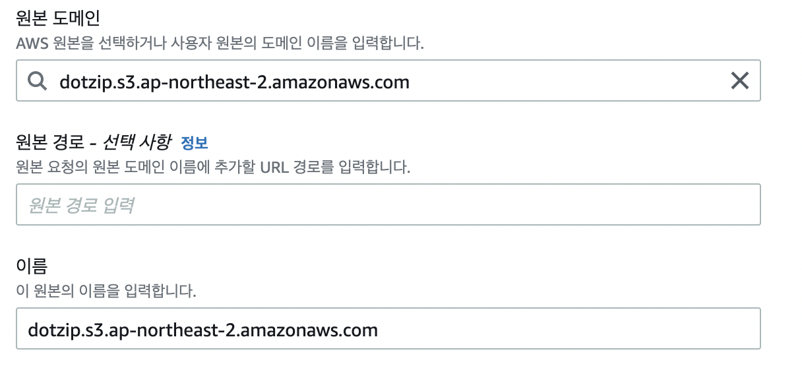
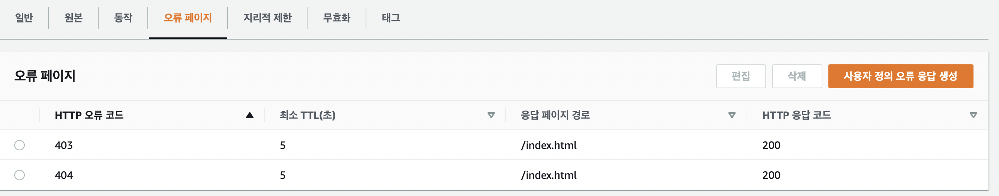

# githubActions.md를 먼저 보고오기!

## AWS CloudFront란 무엇인가?

CloudFront란 AWS에서 제공하는 CDN서비스다. 캐싱을 통해서 사용자에게 좀 더 빠른 데이터 전송 속도를 제공한다. CloudFront는 전 세계에 캐쉬 기능을 하는 Edge Server(Location)을 두고 Client에 가장 가까운 Edge Server를 찾아 Latency를 최소화시켜 빠른 데이터 전송속도를 제공한다. 만약 Edge Server에 요청이 발생한 데이터가 존재하지 않으면 Origin Server(원본 데이터를 가지고 있는 서버. S3나 EC2 인스턴스 등)에 요청이 포워딩 되며, 요청받은 데이터를 Origin Server에서 획득한 후 Edge Server에 캐싱 데이터를 생성하고, 클라이언트로 응답이 발생한다.

CloudFront에서는 HTTP 프로토콜을 이용해서 다운로드 할 수 있는 일반적인 이미지 혹은 정적파일을 제공하며, 스트리밍을 위해 사용할 수 있는 HTTP Progressive Download 방식이나 RTSP(Real Time Streaming Protocol)을 지원하는 동영상 콘텐츠를 제공할 수 있다.

CloudFront의 요금이 S3 요금보다 저렴하기 때문에 비용절감 효과가 있다.

S3를 이용해 직접 배포할 경우 S3 버킷을 설정한 지역의 저장소로 전세계 사용자가 요청을 보낸다. 따라서 먼 지역의 유저일 수록 속도가 느려질 것이다. 하지만 CloudFront를 사용한다면 전세계 엣지 로케이션에서 캐싱을 해두고 유저가 가까운 엣지에 요청을 보내도록 한다. 따라서 S3보다 속도가 더 빠르다.

사용법은 너무나도 쉽다.

도메인 설정을 해주고,

맨 밑에 index.html을 적어주고 다른 설정은 자유롭게 해주고 만들어준다.

만들어진 도메인 이름(주소)로 접속하면 끝! 이 아니다..

우리가 s3에 자동배포를 한다고해서 cdn까지 저절로 업데이트가 되지는 않는다. cloudfront는 캐시가 비어있으면 s3 원본링크를 참조하여 데이터를 가져온다. 기본적으로 24시간마다 캐시가 지워지기 때문에 별도의 설정 없으면 깃허브액션을 사용해도 24시간마다 한번 업데이트가 되는 꼴이 되어버릴거다.

## `무효화`

그래서 cloudfront 상세설정에 무효화를 들어가서 설정을 해주어야한다.
어떠한 상세 경로를 지정해주어 그 파일에 대한 변동이 있으면 캐시가 업데이트 되게 설정해줄수도 있다.
귀찮으니까 어떤곳이든 변화가 일어나면 캐시를 갈아끼라는 의미로 /\*을 적어주자. 이렇게하면 단점도 있긴하다.. 요금!!

근데 이렇게 하면 캐시를 업데이트 해주고 싶을 때마다 다시 이 작업을 반복해줘야한다.

## `React설정`

리액트에서 react-router-dom을 사용한다면
해당 배포 상세페이지를 들어가서 오류 페이지 탭에서 다음과 같이 만들어준다.

[이곳에서참조](https://velog.io/@seongkyun/AWS-S3-CloudFront-Route53을-이용한-정적-호스팅)
