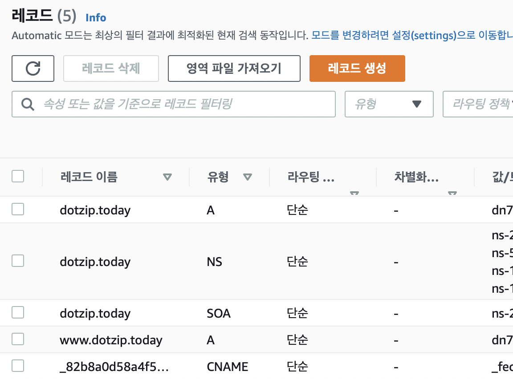

# Route53으로 DNS 연결하기

route53은 AWS에서 제공하는 DNS 이다. 

일반 DNS와 Route53은 어떤 차이점이 있을지와 특징을 알아보자.
우선 DNS의 동작 방식은, 도메인을 IP로 변환하여 IP 네트워크와 통신하여 목적지 IP를 찾아가는 과정이다.

1. 일반적으로는 도메인 등록시에 네임서버가 지정되는데, Route53은 할당받은 네임서버를 도메인 등록한 곳에 접속하여 할당받은 네임서버를 지정해주어야한다.
2. Route53은 Public Host Zone과 Private Host Zone이 있다.
   Public Host Zone은 일반 네임서버로 동작하며, Private Host Zone은 AWS내에서만 동작한다.
3. 도메인 자체에 대해 ALIAS 를 줄 수 있다. dns.com을 예시로, 도메인 자체에 대한 ALIAS Target을 www.dns.com 으로 줄 수 있다. 같은 IP응답을 주게 가능하다는 것이다. www의 아이피를 바꾸면 dns.com의 ip도 같이 바뀌게 된다.
4. 특정 포트에 대해 모니터링이 가능하다. 상태검사 탭에서 모니터링을 원하는 포트를 지정해주면 모니터링이 가능해진다.
5. 네트워크 장비인 넷스케일러, 파운드리, 파이오링크와 같이 Failover를 해주는 기능이 있다. 여기서 Failover란 장애 대비 기능을 말한다. 시스템에 장애가 오면 미리 준비했던 다른 시스템으로 대체해서 운영해주는 것이다.
6. GSLB(Global Server Load Balancing)로 인해 지역에 상관 없이 부하를 분산해주는 기능을 제공해준다. 특정 IDC에 의존적이지 않게, 지역과 나라에 무관하게 Load Balancing이 가능해진다. 상세하게는 Failover, Act-Act(트래픽조절), 지역별 유입 트래픽조절 세가지 기능을 제공해준다.

`사용자에게 좋은점`

1. GUI를 제공한다.
2. 네임서버 자체 안정성이 높아진다.
   Anycast Network + 4개의 네임서버 + ddos로부터의 안전 => 가용성 100% 제공
3. 글로벌 서비스가 가능해진다. => GSLB를 이용한 속도 개선이 가능하다.

## 사용법

aws의 route53으로 들어간다. 호스팅 영역을 생성해준 뒤,

다음과 같이 레코드를 생성해준다.

오른쪽의 값/트래픽-에는 CloudFront 에서 제공되는 도메인이름을 적어주면 된다.

맨 밑에 보이는 녀석은 Certificate Manager에서 만들어주어야 한다. (https)
우선 CM에 들어간 뒤, 인증서를 요청받는다. 정규화된 도메인 이름을 요청하는데, 구매한 도메인을 적어주면 된다.

dotzip.today와 www.dotzip.today를 적어주었는데 www대신에 \* 가 들어가도 된다. 근데 보통은 www로만 접속하니까... 그리고 인증서가 발급될때까지 기다려준다.

한시간이 넘게 걸렸다... 인증서가 발급이 되면 저절로 레코드에 CNAME이라는 유형으로 사진의 맨 아래와 같이 추가가 된다.

이렇게 되면 Route53 설정은 끝!

[해당 블로그 참조](https://brunch.co.kr/@topasvga/49)
