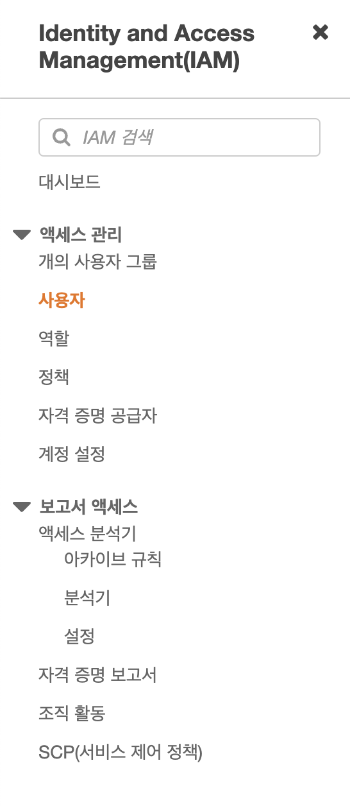
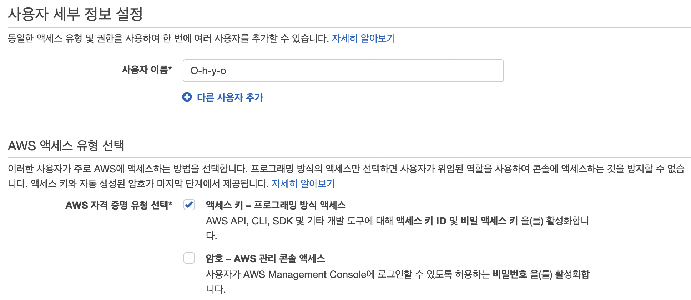
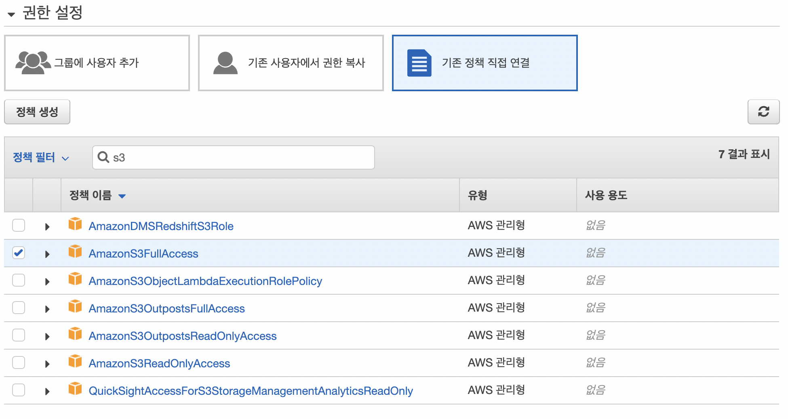

## `github actions CI/CD 구축 / s3버킷에 적용하기`

Github Action 이란, Github에서 제공하는 워크플로우를 자동화하도록 도와주는 도구이다. 테스트, 빌드, 배포 등의 다양한 작업들을 자동화하여 처리한다.

Github가 ms에 인수되면서 기존의 소스저장소의 기능에서 DevOps플랫폼으로 발전했다. 비슷한 서비스로는 GitLab,BitBucket등이 있다.

프로젝트의 최상위 루트에서 .github/workflows/ 경로에 OOO.yml 파일을 추가한다.
내용물에는, 다음과 같이 적는다.

```
 name: Actions deploy                    #   Workflow 이름
on:                                  # Event 감지
  push:
    branches:
      - master                       # 마스터 브랜치에 푸쉬하였을때
jobs:                                # Job 설정
  build:
    runs-on: ubuntu-latest
    steps:
      - name: Checkout source code.   # Repo checkout
        uses: actions/checkout@v2

      - name: Check Node v            # Node v 확인
        run: node -v

      - name: Install Dependencies    # 의존 파일 설치
        run: yarn install --frozen-lockfile

      - name: Build                   # React Build
        run: yarn build
```

추가가 되었으면, github actions 가 aws에 접근할 수 있는 권한을 주기 위해
AWS서비스 중 [보안, 자격 증명 및 규정 준수] 중 [IAM]으로 가서, 좌측의 액세스 관리에서 사용자 탭을 들어간다.





사진을 따라한다.
사진에 없는 탭들은 다음을 눌러준다.
이후 나온 5단계 탭에서 액세스 키ID를 알려줄것이다.
.csv 다운로드를 해준다.



깃허브에서 세팅스 -> 시크릿을 들어가 액세스 키와 비밀액세스 키를 넣어줄 레포 두개를 생성해준다.

처음에 만든 깃허브액션파일에 다음과 같이 추가해준다.

```
name: Actions deploy # Workflow 이름
on: # Event 감지
  push:
    branches:
      - master
jobs: # Job 설정
  build:
    runs-on: ubuntu-latest
    steps:
      - name: Checkout source code. # Repo checkout
        uses: actions/checkout@v2

      - name: Check Node v # Node v 확인
        run: node -v

      - name: Install Dependencies # 의존 파일 설치
        run: yarn install --frozen-lockfile

      - name: Build # React Build
        run: yarn build

      - name: Deploy # Upload build file to S3
        env:
          AWS_ACCESS_KEY_ID: ${{ secrets.SECRET_KEY }}
          AWS_SECRET_ACCESS_KEY: ${{ secrets.SECRET_ACCESS_KEY }}
        run: |
          aws s3 cp --recursive --region ap-northeast-2 build s3://dotzip

      - name: Invalidate Cache CloudFront
        uses: chetan/invalidate-cloudfront-action@master
        env:
          AWS_ACCESS_KEY_ID: ${{secrets.SECRET_KEY}}
          AWS_SECRET_ACCESS_KEY: ${{secrets.SECRET_ACCESS_KEY}}
          AWS_REGION: ${{secrets.AWS_REGION}}
          DISTRIBUTION: ${{secrets.DEV_DISTRIBUTION_ID}}
          PATHS: "/*"
        continue-on-error: true
```

이후 깃허브 액션에 들어가 정상적으로 잘 작동하는지 확인해준다.
